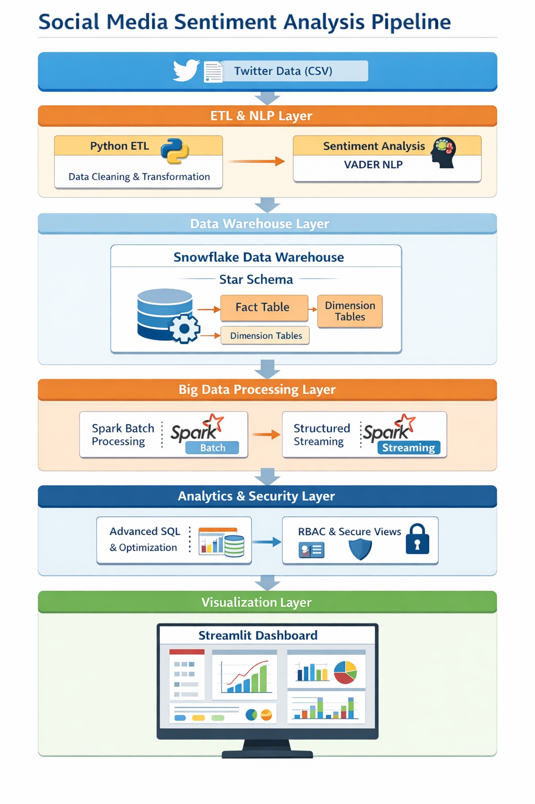

# 📊 Social Media Sentiment Analysis Pipeline

> A full-scale modern data engineering pipeline that ingests large-scale social media data, performs NLP-based sentiment analysis, processes data using Apache Spark, stores it in Snowflake using a Star Schema warehouse design, applies enterprise-level security controls, enables performance optimization, supports semi-structured data handling, and provides interactive analytical insights through a Streamlit dashboard.

---

## 📌 Table of Contents

- [🚀 Project Overview](#-project-overview)
- [🏗 System Architecture](#-system-architecture)
- [🧠 Key Features](#-key-features)
- [📊 Tech Stack](#-tech-stack)
- [📁 Project Structure](#-project-structure)
- [⚙ Data Pipeline Flow](#-data-pipeline-flow)
- [📈 Analytics Capabilities](#-analytics-capabilities)
- [🔐 Security & Governance](#-security--governance)
- [⚡ Big Data & Streaming](#-big-data--streaming)
- [📊 Interactive Dashboard](#-interactive-dashboard)
- [▶ How to Run Locally](#-how-to-run-locally)
- [📚 What This Project Demonstrates](#-what-this-project-demonstrates)
- [👨‍💻 Author](#-author)

---

## 🚀 Project Overview

This project implements a real-world scalable sentiment analytics platform designed to:

- Process large-scale Twitter data (1.6M+ records)
- Perform NLP-based sentiment classification
- Build a structured Data Warehouse (Star Schema)
- Execute advanced SQL analytics
- Optimize performance using Snowflake features
- Handle semi-structured JSON data
- Apply enterprise security principles
- Demonstrate Spark batch processing
- Provide an interactive visualization dashboard

The architecture mirrors production-grade data engineering systems used in modern analytics-driven organizations.

---

## 🏗 System Architecture



```
Raw Social Media Dataset (CSV)
            ↓
Modular Python ETL (Extract → Transform → Load)
            ↓
Sentiment Analysis (VADER NLP)
            ↓
Dimension & Fact Table Construction
            ↓
Snowflake Data Warehouse (Star Schema)
            ↓
Advanced SQL Analytics
            ↓
Clustering + Time Travel Optimization
            ↓
Semi-Structured JSON Handling (VARIANT)
            ↓
Role-Based Access & Secure Views
            ↓
Apache Spark Batch Processing
            ↓
Interactive Streamlit Dashboard
```

---

## 🧠 Key Features

✔ Modular ETL Architecture (Extract / Transform / Load)  
✔ NLP Sentiment Analysis (VADER)  
✔ Star Schema Data Warehouse Design  
✔ Advanced SQL (CTE, Window Functions, Ranking)  
✔ Snowflake Clustering & Time Travel  
✔ Semi-Structured Data using VARIANT (JSON)  
✔ Role-Based Access Control (RBAC)  
✔ Secure View-based Data Masking  
✔ Apache Spark Batch Processing  
✔ Structured Streaming Simulation  
✔ Interactive Streamlit Dashboard  

---

## 📊 Tech Stack

| Layer           | Technology                         |
|-----------------|------------------------------------|
| ETL             | Python, Pandas, VADER              |
| Big Data        | Apache Spark (PySpark)             |
| Warehouse       | Snowflake                          |
| Analytics       | Advanced SQL                       |
| Optimization    | Clustering, Time Travel            |
| Security        | RBAC + Secure Views                |
| Streaming       | Structured Streaming Simulation    |
| Visualization   | Streamlit, Plotly                  |
| Version Control | Git & GitHub                       |

---

## 📁 Project Structure

```
Social-Media-Sentiment-Analysis-Pipeline/
│
├── etl/
│   ├── config.py
│   ├── logger.py
│   ├── extract.py
│   ├── transform.py
│   ├── load.py
│   └── main.py
│
├── dashboard/
│   └── app.py
│
├── spark_batch.py
├── spark_streaming.py
│
├── sql/
│   ├── 01_schema_setup.sql
│   ├── 02_advanced_queries.sql
│   ├── 03_optimization.sql
│   ├── 04_security.sql
│   └── 05_semi_structured.sql
│
├── architecture_diagram.png
├── dashboard_screenshot.png
├── requirements.txt
├── .gitignore
└── README.md
```

---

## ⚙ Data Pipeline Flow

### 🔄 Modular ETL

```
Extract → Clean → Transform → Sentiment Scoring → Load
```

- Data extraction from raw Twitter dataset
- Regex-based text cleaning
- VADER sentiment scoring
- Sentiment classification (Positive / Negative / Neutral)
- Date normalization
- Structured logging
- Config-based thresholds

---

### 🗄 Data Warehouse Layer

Star Schema Implementation:

**Fact Table**
- fact_sentiment

**Dimension Tables**
- dim_user
- dim_date
- dim_platform
- dim_location

Designed for efficient OLAP-style analytical querying.

---

## 📈 Analytics Capabilities

Examples of insights generated:

- 📊 Sentiment distribution by date
- 📅 Rolling average sentiment trend
- 🏆 Most positive/negative days ranking
- 📈 Trend analysis using window functions
- 🔍 Sentiment segmentation by platform/location
- ⚡ Hybrid Spark + Snowflake analytics

---

## 🔐 Security & Governance

Implemented using enterprise design principles:

- Role-Based Access Control (RBAC)
- Secure View-based column masking
- Schema-level privilege management
- Least privilege enforcement model
- Separation of administrative roles

---

## ⚡ Big Data & Streaming

### 🚀 Apache Spark Batch Processing

- Sentiment distribution aggregation
- Daily average sentiment calculation
- Distributed computation over large dataset

### 🔄 Structured Streaming (Simulation)

- Micro-batch processing concept
- Continuous aggregation demonstration
- Real-time analytics simulation

---

## 📊 Interactive Dashboard

Built using Streamlit and Plotly.

Features:

- KPI metrics (Total, Positive, Negative, Neutral)
- Sentiment distribution pie chart
- Daily sentiment trend line chart
- Sentiment score histogram
- Platform-based segmentation
- Interactive filtering (date & sentiment)


---

## ▶ How to Run Locally

### 1️⃣ Install dependencies

```bash
pip install -r requirements.txt
```

### 2️⃣ Run ETL Pipeline

```bash
cd etl
python main.py
```

### 3️⃣ Execute Snowflake SQL Scripts

Run scripts inside Snowflake worksheet from `sql/` folder.

### 4️⃣ Run Spark Batch Job

```bash
py -3.10 spark_batch.py
```

### 5️⃣ Launch Dashboard

```bash
cd dashboard
streamlit run app.py
```

---

## 📚 What This Project Demonstrates

This project showcases:

✅ End-to-end Data Engineering pipeline  
✅ Modular ETL architecture  
✅ Cloud Data Warehouse implementation  
✅ Big Data processing with Spark  
✅ Semi-structured data handling  
✅ Advanced SQL analytics mastery  
✅ Enterprise security design  
✅ Performance tuning techniques  
✅ Production-style project organization  
✅ Interactive analytical visualization  

---

## 👨‍💻 Author

**Suman Dandapat**  
Data Engineering & Analytics Enthusiast  

---